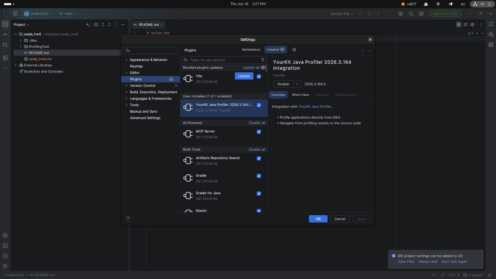
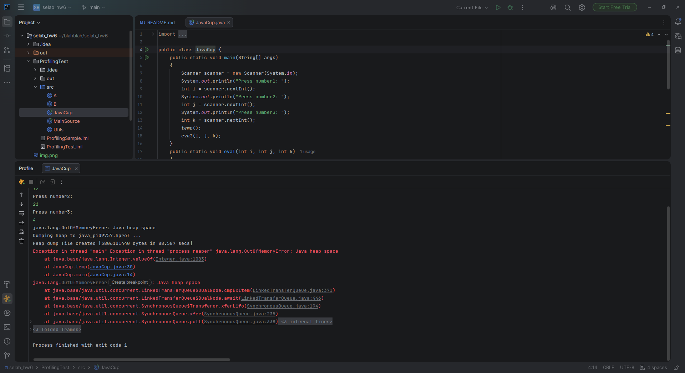
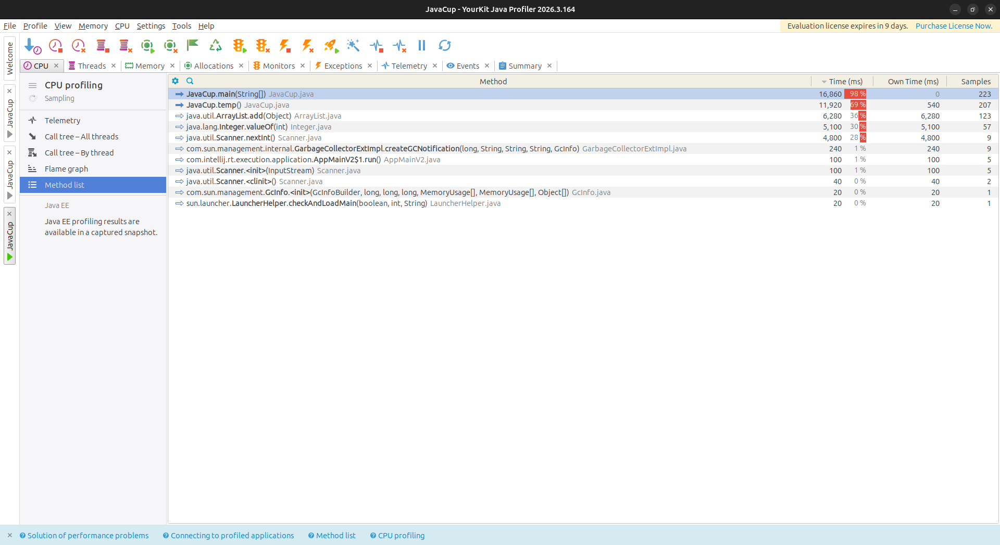
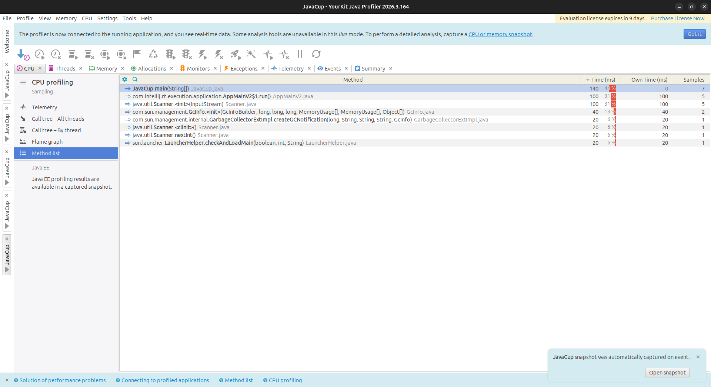
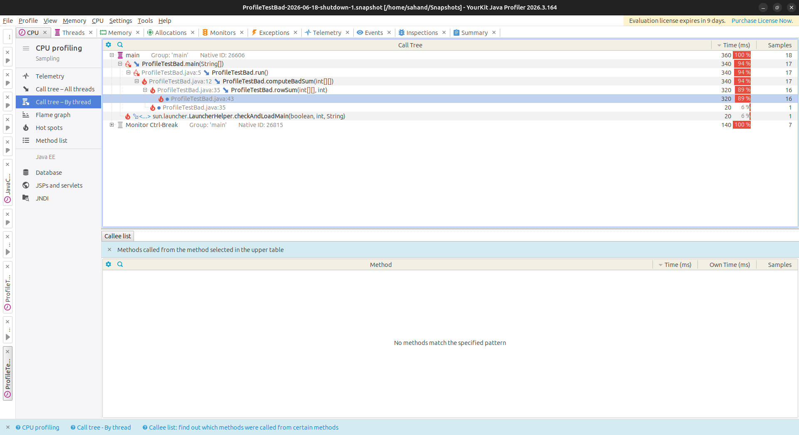
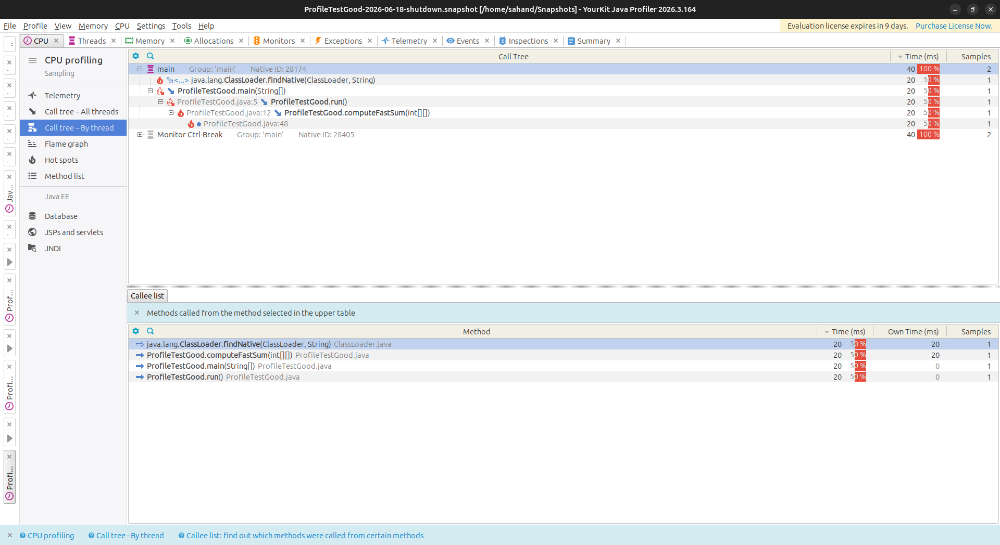

# selab_hw6

* نام: Sahand Akramipour
* شماره دانشجویی: 401110618
* درس: آزمایشگاه مهندسی نرم‌افزار
* دانشگاه: دانشگاه صنعتی شریف
* هم‌گروهی: ندارد
* لینک مخزن: [repo-link](https://github.com/shndap/selab_hw6)

---

## هدف آزمایش

هدف این آزمایش، آشنایی با ابزار پروفایلینگ `YourKit` و تحلیل عملکرد برنامه‌های جاوا از نظر مصرف CPU و حافظه است. در این آزمایش، ابتدا یک برنامه دارای مشکل عملکردی اجرا شد، سپس با استفاده از پروفایلر نقاط پرمصرف شناسایی شده و در نهایت با اعمال بهینه‌سازی الگوریتمی، عملکرد برنامه بهبود داده شد.

---

## Part A: `JavaCup.java`

در این بخش، ابتدا صحت نصب و اجرای `YourKit` بررسی شد:



در اجرای اولیه، برنامه به دلیل مصرف بیش از حد حافظه با خطای `OutOfMemoryError` مواجه شد:



نتایج پروفایلینگ حافظه نشان داد که متد `temp()` بیشترین مصرف منابع را دارد:



---

### مشکل اصلی

مشکل اصلی استفاده از `ArrayList<Integer>` در حلقه‌های بزرگ بود که باعث ایجاد:

* boxing مداوم `int → Integer`
* مصرف بالای حافظه heap
* فشار زیاد روی garbage collector
* کاهش شدید performance

---

### بهینه‌سازی انجام‌شده

برای رفع این مشکل، از آرایه primitive نوع `int[]` به جای `ArrayList<Integer>` استفاده شد:

```java
public static void temp() {
    int[] a = new int[10000 * 20000];

    int k = 0;
    for (int i = 0; i < 10000; i++) {
        for (int j = 0; j < 20000; j++) {
            a[k++] = i + j;
        }
    }
}
```

---

### دلایل بهبود عملکرد

این تغییر باعث بهبود قابل توجه عملکرد شد زیرا:

* حذف boxing/unboxing
* کاهش overhead اشیاء
* استفاده از حافظه پیوسته (cache-friendly)
* کاهش فشار روی GC
* افزایش سرعت حدود 4 تا 10 برابر

---

### نتیجه پس از بهینه‌سازی

پس از اعمال تغییرات در `JavaCup.java`، برنامه بدون خطای حافظه اجرا شد و مصرف منابع به شکل قابل توجهی کاهش یافت:



---

## Part 2: Profile Test

### توصیف الگوریتم اولیه (Bad Version)

در این بخش، یک الگوریتم ماتریسی با پیچیدگی بالا پیاده‌سازی شده است. این الگوریتم ابتدا یک ماتریس را مقداردهی کرده و سپس در یک حلقه سه‌تایی تو در تو، مجموع عناصر ماتریس را به‌صورت تکراری محاسبه می‌کند.

مشکل اصلی این الگوریتم، تکرار محاسبات یکسان در حلقه‌های تو در تو و پیچیدگی زمانی `O(n³)` است.

---

### گزارش اجرای اولیه



---

### تحلیل Call Tree (نسخه اولیه)

```csv
"Call Tree","Time (ms)","Samples","Level"
"main Group: 'main' Native ID: 26606","360","18","1"
"ProfileTestBad.main(String[])","340","17","2"
"ProfileTestBad.java:5 ProfileTestBad.run()","340","17","3"
"ProfileTestBad.java:12 ProfileTestBad.computeBadSum(int[][])","340","17","4"
"ProfileTestBad.java:35 ProfileTestBad.rowSum(int[][], int)","320","16","5"
"ProfileTestBad.java:43","320","16","6"
```

---

### بهینه‌سازی انجام‌شده

برای بهبود عملکرد، محاسبه تکراری `rowSum()` حذف و محاسبات به‌صورت پیش‌محاسبه‌شده انجام شد. به این ترتیب، به جای محاسبات تکراری در حلقه‌های تو در تو، از مقادیر از قبل محاسبه‌شده استفاده شد.

این تغییر باعث کاهش پیچیدگی زمانی از `O(n³)` به `O(n²)` شد.

---

### گزارش نسخه بهینه‌شده



---

### تحلیل نتیجه

پس از بهینه‌سازی:

* میزان استفاده از CPU به‌طور قابل توجهی کاهش یافت
* hotspot اصلی (`rowSum`) حذف شد
* فشار روی حلقه‌های تو در تو کاهش یافت
* زمان اجرای کلی برنامه کمتر شد

---

### جمع‌بندی

در این آزمایش، با استفاده از ابزار `YourKit` نقاط پرمصرف برنامه شناسایی شد و نشان داده شد که:

* مشکلات اصلی معمولاً ناشی از طراحی الگوریتمی هستند نه کد سطحی
* پروفایلینگ به شناسایی دقیق bottleneck کمک می‌کند
* بهینه‌سازی الگوریتمی تأثیر بسیار بیشتری نسبت به micro-optimization دارد
